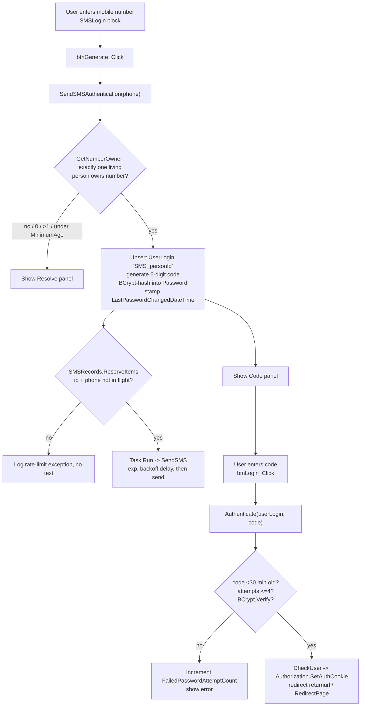

# org.secc.Authentication

> A passwordless **SMS one-time-code** authentication provider for Rock — texts a 6-digit code to a person's mobile number and logs them in with it.

> **Doc tier: deep.** Small surface (one auth component + one login block) but it's a credential-issuing authentication path — documented at the deeper tier so the code lifecycle, rate limiting, and security trade-offs are explicit. Most SECC plugins use the lighter standard tier.

## Overview

Authentication lets a person sign in to Rock with their cell phone instead of a password: they enter their mobile number, Rock looks up the (single) owner of that number, generates a random 6-digit code, BCrypt-hashes it into a per-person `UserLogin`, and texts it to them. They type the code back and are logged in. It plugs into Rock's standard auth stack as an `AuthenticationComponent` (`Rock.Security.ExternalAuthentication.SMSAuthentication`) and ships one block (**SMS Login**) that drives the two-step UI. Used for low-friction member login on public-facing pages where a stored password is undesirable.

## Project Info

- **Project file:** `org.secc.Authentication.csproj`
- **Root namespace:** `org.secc.Authentication`
- **Target framework:** .NET Framework 4.7.2
- **Deploys to:** `RockWeb/bin/` (assembly) and `RockWeb/Plugins/org_secc/` (block markup), via the `PostBuildEvent` `xcopy`.
- **No /Migrations** — the auth component and block self-register through Rock's MEF / block discovery; the SMS Login page is referenced by Guid (`C137E7F2-…`) but not created by this plugin.

## Project Layout

```
/                              SMSAuthentication.cs — the AuthenticationComponent + SMSRecords/SMSRecord rate-limit helpers
/org_secc/Authentication/      SMSLogin.ascx (+ .ascx.cs) — the two-step phone-number / code login block
/Properties/                   AssemblyInfo.cs
```

## How SMS Login Works

The block and the component split the work: the block owns the UI and the final sign-in; the component owns code generation, the SMS send, validation, and rate limiting. Both the "generate" and "verify" steps re-derive the `UserLogin` from the phone number (`SMS_<personId>`), so there is no server-side session between the two postbacks.



**Conventions / contracts:**
- The component is discovered by MEF: `[Export(typeof(AuthenticationComponent))]` + `[ExportMetadata("ComponentName", "SMS Authentication")]`, registered under the type name `Rock.Security.ExternalAuthentication.SMSAuthentication` (note: the class lives in the Rock namespace, not `org.secc`).
- `ServiceType` is `External` and `RequiresRemoteAuthentication` is `true` — Rock treats it like a third-party provider. (OAuth's resource-owner grant special-cases this same type; see [org.secc.OAuth](../org.secc.OAuth/README.md).)
- The OTP is the `UserLogin.Password`: a cryptographically-secure 6-digit value (100000–999999, generated with `RandomNumberGenerator`), BCrypt-hashed via the **BCrypt Cost Factor** attribute. The code's validity window is enforced off `LastPasswordChangedDateTime` (30 minutes), and the attempt cap off `FailedPasswordAttemptCount` (5).
- One `UserLogin` per person, keyed `SMS_<person.Id>`. It is upserted on each generate (resets failed-attempt count, re-stamps the timestamp, sets `IsConfirmed = true`).
- Phone-number ownership must resolve to **exactly one** living person; 0, >1, or deceased fails closed with a generic "There was an issue with your request" message.
- Rate limiting is **in-process static state** (`SMSRecords`) keyed on IP + phone number — not persisted, so it resets on app-pool recycle and is per-server.

## Components

### Authentication Component — `SMSAuthentication`

Category: standard Rock authentication providers (Admin Tools > Security > Authentication Services). Settings below show the attribute **name**; the code reads them by their space-stripped key (`SMS Login Page` -> `SMSLoginPage`, `BCrypt Cost Factor` -> `BCryptCostFactor`, `Minimum Age` -> `MinimumAge`).

| Setting | Type | Notes |
|---------|------|-------|
| **SMS Login Page** | linked page (default `C137E7F2-DDB6-404F-AFD3-4D741E0DA43A`) | Page hosting the SMS Login block; used by `GenerateLoginUrl` to redirect into the flow. |
| **BCrypt Cost Factor** | integer (default `11`) | Work factor for hashing the OTP. Higher = slower/more secure. |
| **From** | defined value (`COMMUNICATION_SMS_FROM`), required | The SMS From number the code is sent from. |
| **Message** | text, required | Body of the code text. `{{ password }}` merges in the 6-digit code; default also merges `OrganizationName`. |
| **Minimum Age** | integer (default `13`) | Minimum age allowed to log in; `0` disables the check. Unknown age fails when a minimum is set. |

Notable methods: `SendSMSAuthentication(phone)` (generate + send), `Authenticate(userLogin, code)` (verify), `GetNumberOwner(...)` (single-owner resolution + age gate). `EncodePassword`, `ChangePassword`, and `SetPassword` throw `NotImplementedException`; `IsReturningFromAuthentication` and the request-based `Authenticate` overload are no-ops that always return `false` (`SupportsChangePassword` is `false` and `ImageUrl()` returns `""`). Code generation is driven by the block, not by Rock's standard remote-auth round-trip.

### Block — SMS Login (`org_secc/Authentication/SMSLogin.ascx`)

Category in Rock: **SECC > Security**. Three panels (phone → code → resolve) in a single `UpdatePanel`. Client-side JS submits on Enter and auto-submits when 6 digits are entered.

| Setting | Type | Notes |
|---------|------|-------|
| **Prompt Message** | code editor (HTML) | Shown above the phone-number entry. |
| **Resolve Number Page** | linked page, required | Where to send a user whose number couldn't be resolved (to add/fix a mobile number). |
| **Resolve Message** | code editor (HTML) | Shown when the number can't be resolved to a single account. |
| **Redirect Page** | linked page, required | Where to send on successful login (falls back to `returnurl`, then site default). |

## Dependencies & Integrations

- **Rock:** `AuthenticationComponent`, `UserLogin`/`UserLoginService`, `PhoneNumberService`, `RockSMSMessage`/`RockSMSMessageRecipient`, `Authorization.SetAuthCookie`, `DefinedValueCache`/`EntityTypeCache`, `ExceptionLogService`, `RockBlock`.
- **Third-party:** `BCrypt.Net` (OTP hashing); the OTP text rides Rock's configured SMS transport (Twilio etc.).
- **Cross-plugin:** none required. Related: [org.secc.OAuth](../org.secc.OAuth/README.md) explicitly permits this provider in its resource-owner grant.

## Edge Cases & Constraints

- **Number must map to exactly one living person.** `GetNumberOwner` rejects 0 matches, >1 matches, and deceased people — all with the same generic error (the **Resolve Number Page** is the escape hatch for shared/duplicate numbers).
- **Code lifetime is 30 minutes, hard-coded.** `Authenticate` rejects any code whose `LastPasswordChangedDateTime` is older than 30 minutes (or null). Not configurable.
- **Two failed-attempt caps exist and disagree.** The component rejects once `FailedPasswordAttemptCount > 4` (i.e. on the 6th attempt); the block's `CheckUser` separately checks `> 5`. Generating a new code resets the count to 0.
- **Rate limiting is best-effort and in-memory.** `SMSRecords` reserves an IP+phone pair while a send is in flight and applies an exponential backoff (`2^count` ms) based on a rolling 1-hour window. State is static/per-process — it does not survive recycles and isn't shared across web servers. If a pair is already reserved, the request is dropped and logged (the user simply doesn't get a text).
- **Send is fire-and-forget.** The text goes out on a `Task.Run(...)` `async void` (`SendSMS`); failures are logged but never surfaced to the user, who still sees the code-entry panel.
- **Page is referenced, not created.** The default **SMS Login Page** Guid must already exist in the target Rock instance; this plugin ships no migration to create it.

## Observations

*Noticed while documenting — not a full audit; the auth path was the focus.*

- **Security (resolved — ROCK-8764):** The OTP was previously generated with `new Random().Next(100000, 999999)` — `System.Random` is **not** a cryptographic RNG and is clock-seeded per call. It is now generated with `RandomNumberGenerator` (cryptographically secure), covering the full 100000–999999 range, and remains BCrypt-hashed at rest. See `GenerateSecureOtp` in `SMSAuthentication.cs`.
- **Security (review):** Lockout is per-issued-code, not durable — requesting a new code resets `FailedPasswordAttemptCount` to 0, so an attacker who can trigger generation can keep refreshing the 5-guess budget. The IP/phone rate limiter mitigates send-flooding but not guess-resetting. Worth confirming the abuse model is acceptable.
- **Security (low):** Login resolution trusts an exact `PhoneNumber.Number` string match (`GetPhoneNumber` strips non-digits client-side). Numbers stored with country code / extension differences won't match; not a vulnerability but a UX/lookup gap that routes users to the Resolve page.
- **Improvement:** `AuthenticateBcrypt` computes `currentCost = hash.Substring(4,2)...` and never uses it — dead code. `GetNumberOwner` calls `.ToList()` then `DistinctBy` in memory; fine for the expected tiny result set.
- **Improvement:** `SendSMS`'s parameters are declared `(smsMessage, phoneNumber, ipAddress, delay)` but the call site passes `(smsMessage, ipAddress, phoneNumber, delay)` — the `ipAddress`/`phoneNumber` arguments are swapped. They're only used together in `ReleaseItems`, so release still works, but the names are misleading; worth aligning.

## Extending

To change how the code is generated, hashed, or validated, edit `SMSAuthentication.cs` — `SendSMSAuthentication` (issue) and `Authenticate` (verify) are the two halves. The block calls only those public methods plus `GetNumberOwner`, so a UI variant can reuse the component as-is:

```csharp
// New login surface reusing the component
var sms = new Rock.Security.ExternalAuthentication.SMSAuthentication();
if ( sms.SendSMSAuthentication( phone ) )      // issues + texts the code
{
    // ... collect the code from the user ...
    var userLogin = new UserLoginService( rockContext ).GetByUserName( "SMS_" + personId );
    if ( sms.Authenticate( userLogin, code ) ) // verifies window + attempts + BCrypt
    {
        Rock.Security.Authorization.SetAuthCookie( userLogin.UserName, true, false );
    }
}
```

No registration step is needed for the component — MEF discovers `[Export(typeof(AuthenticationComponent))]` at startup and renders its attributes in the authentication-services admin UI.

## Making Changes

- Code lifecycle, rate limiting, age/owner rules, and the SMS body live in `SMSAuthentication.cs`.
- Login screen, panel flow, and the Enter/auto-submit JS live in `org_secc/Authentication/SMSLogin.ascx(.cs)`.
- The **From** number, **Message**, **BCrypt Cost Factor**, and **Minimum Age** are component attributes (Admin Tools > Security > Authentication Services), not block settings.
- This provider is allowed by [org.secc.OAuth](../org.secc.OAuth/README.md)'s resource-owner grant — coordinate changes to the `Rock.Security.ExternalAuthentication.SMSAuthentication` type name with that plugin.

**Last updated:** 2026-07-17
