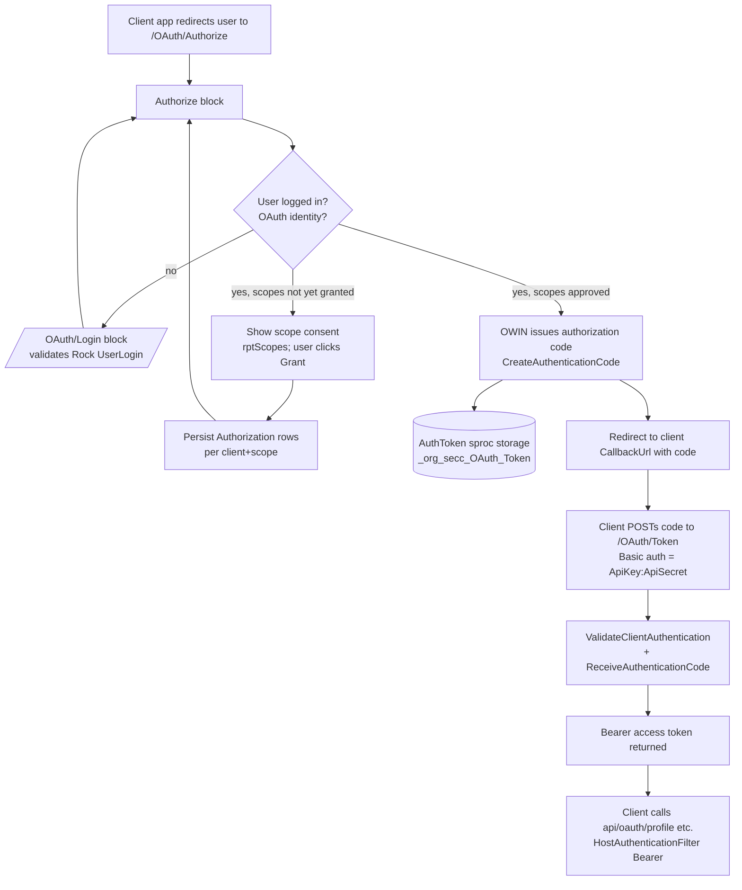

# org.secc.OAuth

> A self-hosted **OAuth 2.0 authorization server** for Rock — issues tokens against Rock `UserLogin` credentials, with admin-managed clients/scopes and a small set of profile REST endpoints.

> **Doc tier: deep.** This plugin is externally-facing security infrastructure (it stands up an OWIN OAuth authorization server inside Rock and brokers credentials), so it's documented at the deeper technical tier — token flow, the OWIN provider contract, config attributes, and edge cases. Most SECC plugins use the lighter standard tier.

## Overview

OAuth turns Rock into its own OAuth 2.0 provider. It wires an OWIN authorization server into the Rock pipeline at startup, hosts a login/authorize/logout portal on a dedicated Rock site, and lets staff register **clients** (API key/secret + callback URL) and **scopes** through an admin block. Third-party apps send users to the Authorize page, the user signs in with their Rock credentials and consents to scopes, and the app exchanges the resulting code for a bearer token it can use against the `api/oauth/*` endpoints (or any Rock REST endpoint). It also ships "service provider" blocks so one Rock instance can act as an OAuth *client* of another (auth chaining / SSO between Rock sites).

## Project Info

- **Project file:** `org.secc.OAuth.csproj`
- **Root namespace:** `org.secc.OAuth`
- **Target framework:** .NET Framework 4.7.2
- **Deploys to:** `RockWeb/bin/` (assembly + `Microsoft.Owin.Security.OAuth/Cookies`, `System.Web.Http.Owin`, `Microsoft.AspNet.Identity.Core`, `DotNetOpenAuth*`) and `RockWeb/Plugins/org_secc/` (block markup)

## Project Layout

```
/                       Startup.cs — IRockOwinStartup hook that builds the OAuth server; OAuthClient.cs — client-side helper
/Data/                  OAuthContext (EF DbContext on RockContext) + base OAuthService<T>
/Model/                 Client, Scope, ClientScope, Authorization entities + services; AuthToken + AuthTokenService (sproc-backed code storage)
/Rest/Controllers/      OAuthController — api/oauth/* profile + family endpoints (bearer-gated)
/Utilities/             TokenResponse — DTO for deserializing a token endpoint response
/Migrations/            Rock plugin migrations (tables, OAuth site/pages, admin page, seed client/scopes, token storage)
/org_secc/OAuth/        UI blocks (.ascx + .ascx.cs): Authorize, Login, Logout, Configuration, OAuthServiceProvider, OAuthRestorer, AuthLogout
```

## How the OAuth Server Works

`Startup` implements `Rock.Utility.IRockOwinStartup`; Rock calls `OnStartup(IAppBuilder)` and the plugin registers cookie auth, an OAuth authorization server, and bearer authentication onto the OWIN pipeline. Endpoint paths and lifespans come from the `OAuthSettings` global attribute (a key/value list).



**Conventions / contracts:**
- **Startup ordering** is `0` (does not matter). The hook runs `app.UseCookieAuthentication`, `app.UseOAuthAuthorizationServer`, and `app.UseOAuthBearerAuthentication`.
- The OWIN `OAuthAuthorizationServerProvider` delegates drive the server lifecycle: `OnValidateClientRedirectUri`, `OnValidateClientAuthentication`, `OnGrantResourceOwnerCredentials`, `OnGrantClientCredentials` (all in `Startup`).
- **Authorization codes** are generated as two concatenated GUIDs and persisted via `AuthTokenService` (stored procedures `_org_secc_OAuth_spAddToken/spGetTicket/spDeleteToken`); a code is single-use — `ReceiveAuthenticationCode` deletes it on consumption.
- **Refresh tokens** are serialized OWIN tickets with an optional lifespan from `OAuthRefreshTokenLifespan` (hours).
- **Scopes** are carried as `urn:oauth:scope` claims. A request only gets the intersection of requested scopes and the client's active `ClientScope` rows. If a client has *no* active client-scopes, all requested scopes are auto-approved (see Edge Cases).
- **Credential validation** reuses Rock's `AuthenticationContainer` components — the same providers Rock uses for normal login (password, SMS, etc.), respecting `IsConfirmed` / `IsLockedOut`.
- Entities are EF models on a dedicated `OAuthContext` that shares the `RockContext` connection but has its EF initializer set to `null` (no auto-migration).

## Components

### REST Endpoints

Routes registered via `IHasCustomHttpRoutes`. The controller suppresses default host auth and applies a `HostAuthenticationFilter` for `OAuthDefaults.AuthenticationType` (bearer).

| Route | Method | Scope required | Purpose |
|-------|--------|----------------|---------|
| `api/oauth/userlogin` | GET (bearer) | — | Returns `{ "Value": <username> }` for the token's current user. |
| `api/oauth/profile` | GET (bearer) | `profile` | Returns a `Profile` (name, gender, birthdate, email, previous person ids). |
| `api/oauth/family` | GET (bearer) | `family` | Returns the user's family members, each with role + `Profile`. |

The token (`/OAuth/Token`) and authorize (`/OAuth/Authorize`) endpoints are **OWIN** endpoints registered in `Startup`, not MVC/WebApi routes — their paths are configured by `OAuthSettings`.

### Blocks

Categories in Rock: **SECC > Security** and **SECC > OAuth**.

| Block | Category | Purpose |
|-------|----------|---------|
| OAuth Configuration | SECC > Security | Admin page: edit `OAuthSettings`, manage clients (key/secret/callback/scopes) and scopes. |
| OAuth Authorize | SECC > Security | The authorization endpoint UI — consent/scope grant, restricted-group auth enforcement. |
| OAuth Login | SECC > Security | Username/password login during the OAuth flow (issues the OWIN application cookie). |
| OAuth Logout | SECC > Security | Signs the user out of the OAuth (OWIN) session. |
| OAuth Service Provider | SECC > OAuth | Makes *this* Rock an OAuth **client** of another provider (kicks off the code flow, exchanges the code, logs the user in). |
| OAuth Session Restorer | SECC > OAuth | Replays a stored `OAuthQueryString` cookie back into the Authorize page (auth chaining). |
| Auth Logout | SECC > OAuth | Chained logout: signs out locally then forwards to an upstream provider's logout URL. |

#### OAuth Configuration  *(SECC > Security)*
Keys in **bold** are the block attribute keys.

| Setting | Type | Notes |
|---------|------|-------|
| **OAuthConfigAttributeKey** | text (default `OAuthSettings`) | Which global attribute holds the server settings. |
| **OAuthSite** | site (default `1`) | The OAuth portal site whose page routes populate the path dropdowns. |

Saving writes the route/SSL/lifespan choices back into the `OAuthSettings` global attribute and flushes the attribute + global caches.

#### OAuth Authorize  *(SECC > Security)*
| Setting | Type | Notes |
|---------|------|-------|
| **OAuthConfigAttributeKey** | text, required (default `OAuthSettings`) | Server settings source. |
| **RestrictedSecurityGroups** | enhanced-list (groups) | Members of these groups are limited to specific auth providers. |
| **ApprovedAuthenticationProviders** | components (`AuthenticationContainer`) | Auth providers permitted for restricted-group members. |
| **RejectedAuthenticationPage** | linked page | Where to send a restricted user who used a disallowed method. |
| **AcceptableDomain** | text | If set and the request host differs, redirects to `https://<domain>` (fixes legacy bad URLs). |

#### OAuth Login  *(SECC > Security)*
Mirrors Rock's stock login block: **NewAccountPage**, **HelpPage**, **ConfirmCaption**, **ConfirmationPage**, **ConfirmAccountTemplate**, **LockedOutCaption**, **HideNewAccount**, **NewAccountButtonText**, **PromptMessage**. On success it sets the Rock auth cookie and creates the OWIN OAuth identity (name + first/nick/last name claims).

#### OAuth Service Provider  *(SECC > OAuth)*
| Setting | Type | Notes |
|---------|------|-------|
| **OAuthClient** | dropdown (from `_org_secc_OAuth_Client`) | The client record (key/secret/callback) used against the upstream provider. |
| **AuthorizationURI** | text | Upstream authorize endpoint. |
| **TokenURI** | text | Upstream token endpoint. |
| **UserLoginEndpoint** | text | Upstream `api/oauth/userlogin`-style endpoint used to resolve the username. |

### Data Model

The four EF entities below are `DbSet`s on `OAuthContext` and each is a `Rock.Data.Model<T>` implementing `Rock.Security.ISecured`. `AuthToken` is **not** on the context and is **not** `ISecured` — it's a plain `internal` POCO accessed only via stored procedures:

| Entity | Table | On `OAuthContext`? | Notes |
|--------|-------|--------------------|-------|
| `Client` | `_org_secc_OAuth_Client` | yes | ClientName, ApiKey (Guid), ApiSecret (Guid), CallbackUrl, Active. |
| `Scope` | `_org_secc_OAuth_Scope` | yes | Identifier, Description, Active. |
| `ClientScope` | `_org_secc_OAuth_ClientScope` | yes | Which scopes a client may request (Active). |
| `Authorization` | `_org_secc_OAuth_Authorization` | yes | A user's per-client, per-scope consent (Active). |
| `AuthToken` | `_org_secc_OAuth_Token` | no (sproc-backed) | Authorization-code storage; `internal` POCO, not `ISecured`, accessed only via `AuthTokenService` sprocs. |

## Dependencies & Integrations

- **Rock:** `IRockOwinStartup`, `RockContext`, `UserLoginService` / `AuthenticationContainer`, `Rock.Security.Authorization`, `GlobalAttributesCache`, `RockBlock`, Rock REST (`IHasCustomHttpRoutes`), plugin migrations.
- **Third-party:** OWIN / Katana (`Microsoft.Owin.Security.OAuth`, `.Cookies`), `Microsoft.AspNet.Identity.Core`, `DotNetOpenAuth.OAuth2` (the client-side `WebServerClient` in `OAuthClient`), `Newtonsoft.Json`, EntityFramework 6.
- **Cross-plugin:** none required at build time.

## Migrations

Ships Rock plugin migrations under `/Migrations/`:

- `201605171249414_InitialCreate` — the four OAuth tables (Client, Scope, ClientScope, Authorization).
- `201605201037000_CreatePlugin` — `OAuthSettings` global attribute, the OAuth **site**, portal/login/authorize/logout pages + routes, and the portal blocks.
- `201605271634000_CreateAdminPage` — the **OAuth Configuration** admin page/block under Rock RMS.
- `201605311211000_CreateClientScopes` — seeds an initial client and its client-scope rows.
- `202507111500_CreateTokenStorage` — `_org_secc_OAuth_Token` table + `spAddToken`/`spGetTicket`/`spDeleteToken` stored procedures for authorization-code storage.

## Edge Cases & Constraints

- **Empty client-scope list = open consent.** In both `GrantResourceOwnerCredentials` (Startup) and the Authorize block, if a client has *no* active `ClientScope` rows, the scope check short-circuits to approved. A client registered without scopes effectively bypasses scope filtering — confirm that's intended for every registered client.
- **SSL is enforced two ways.** `Startup` passes `AllowInsecureHttp = !OAuthRequireSsl`, and the Authorize block throws `"OAuth requires SSL."` on non-HTTPS when `OAuthRequireSsl` is true. Turning SSL off is a deliberate, global toggle in `OAuthSettings`.
- **Authorization codes are single-use and server-stored.** `ReceiveAuthenticationCode` deletes the row on use; there is no built-in expiry/cleanup of unconsumed `_org_secc_OAuth_Token` rows (worth a janitor job if codes are abandoned often).
- **Default `OAuthSettings` seed has a duplicate key.** The migration default string contains `OAuthTokenPath` twice (`/OAuth/Logout` then `/OAuth/Token`) and no `OAuthRefreshTokenLifespan`; values are normally corrected through the Configuration block on first save.
- **SMS auth is special-cased.** The resource-owner grant allows `Rock.Security.ExternalAuthentication.SMSAuthentication` even though it normally requires remote authentication.
- **Service-provider block needs a session.** `OAuthServiceProvider.OnInit` sets a dummy `Session["MockData"]` to guarantee a session exists before DotNetOpenAuth prepares the user-authorization request.

## Observations

*Noticed while documenting — not a full audit; security-sensitive areas flagged for confirmation.*

- **Security (review):** Client credentials are matched with a LINQ-to-SQL string compare on `ApiKey`/`ApiSecret` GUIDs (`ValidateClientAuthentication`), and the `ApiSecret` is a plain GUID stored in the clear in `_org_secc_OAuth_Client` and shown in the admin UI. These act as a client password; confirm the admin page/block security is locked to trusted staff and consider whether secrets should be hashed. Comparison is not constant-time, though GUID secrets make timing attacks impractical.
- **Security (review):** `OAuthController` endpoints catch all exceptions and return a generic 500, but `GetProfile`/`GetFamily` gate only on the presence of a `profile`/`family` scope claim — there is no per-field consent beyond that. Worth confirming the `profile` scope's data set (name, birthdate, email, previous person ids) matches what consenting users expect to share.
- **Security (low):** The Authorize block's restricted-group check (`IsAuthenticationNotPermitted`) only restricts members of the configured groups; everyone else is unrestricted by design. Verify the restricted groups + approved providers are configured for any staff/admin roles you intend to constrain.
- **Improvement:** `OAuthContext`, `RockContext`, and the various services are newed up per request/method (and several per call inside `GrantResourceOwnerCredentials`). Fine for an auth path, but the repeated `clientScopeService.Queryable()...` calls in the grant/authorize loops re-query the same client scopes multiple times.
- **Improvement:** `AuthToken`/`AuthTokenService` bypass EF and call raw sprocs; the rest of the model uses `OAuthContext`. Two storage idioms in one plugin — intentional (the token table was added much later, in the 2025 migration) but worth a note for maintainers.

## Extending

To register a new bearer-protected endpoint, add an action to the partial `OAuthController` and gate it on a scope claim:

```csharp
// Rest/Controllers/OAuthController.Partial.cs
[System.Web.Http.Route( "api/oauth/giving" )]
public HttpResponseMessage GetGiving()
{
    var id = ( ClaimsIdentity ) User.Identity;
    if ( id == null || !id.Claims.Any( c => c.Type == "urn:oauth:scope" && c.Value.ToLower() == "giving" ) )
    {
        return ControllerContext.Request.CreateResponse( HttpStatusCode.Forbidden, "Forbidden" );
    }
    var currentUser = UserLoginService.GetCurrentUser();
    // … build and return the payload …
    return ControllerContext.Request.CreateResponse( HttpStatusCode.OK, /* dto */ null );
}
```

Then create a matching **Scope** (Identifier `giving`) in the OAuth Configuration block and add it to each client that should be allowed to request it. No code change is needed to wire scopes to clients — that's all admin data.

## Making Changes

- Server behavior (token lifespans, grant logic, scope claim handling) lives in `Startup.cs`; endpoint paths and SSL are data in the `OAuthSettings` global attribute, edited via the **OAuth Configuration** block (`org_secc/OAuth/Configuration.ascx.cs`).
- Consent UI and scope-grant persistence are in `org_secc/OAuth/Authorize.ascx.cs`; the login screen is `Login.ascx.cs`.
- New tables, pages, or seed clients/scopes belong in a new numbered migration under `/Migrations/` — don't hand-edit migrations that have already run.
- For Rock-acting-as-client (SSO between sites), configure the **OAuth Service Provider** block and `OAuthClient.cs`; pair with **OAuth Session Restorer** / **Auth Logout** for chained login/logout.
