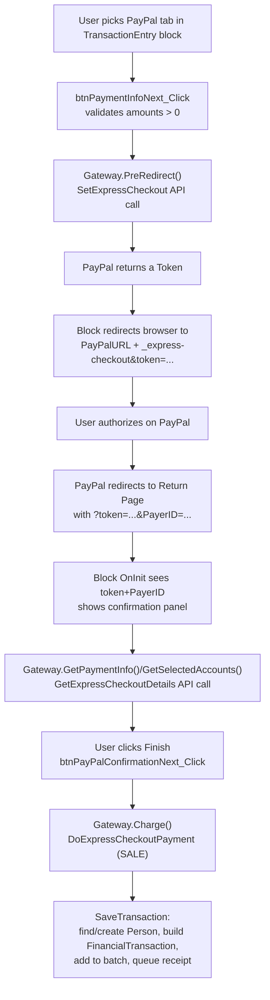

# org.secc.PayPalExpress

> A Rock financial **gateway component** for PayPal Express Checkout (Classic Merchant API), plus a drop-in Transaction Entry block that adds a PayPal tab to Rock's giving flow.

> **Doc tier: deep.** This plugin handles money and credentials — it brokers a redirect-based payment flow against PayPal's API, decrypts API credentials, and creates `FinancialTransaction` records — so it's documented at the deeper technical tier (payment flow, gateway contract, config attributes, edge cases). Most SECC plugins use the lighter standard tier.

## Overview

PayPalExpress lets Southeast accept one-time gifts through PayPal Express Checkout alongside Rock's built-in credit-card/ACH gateways. It supplies a `GatewayComponent` (`Gateway`) that talks to PayPal's **Classic** Merchant API (`SetExpressCheckout` / `GetExpressCheckoutDetails` / `DoExpressCheckoutPayment` / `RefundTransaction`) via the legacy `PayPalMerchantSDK`, and a `TransactionEntry` block that subclasses Rock's stock giving block to inject a "PayPal" payment tab. Because PayPal Express is redirect-based, the block hands off to PayPal, then resumes on the configured Return page (carrying `token` + `PayerID`) to confirm and capture the gift. Only **one-time** gifts are supported — all scheduled-payment methods are stubs.

## Project Info

- **Project file:** `org.secc.PayPalExpress.csproj`
- **Root namespace:** `org.secc.PayPalExpress`
- **Target framework:** .NET Framework 4.7.2
- **Deploys to:** `RockWeb/bin/` (the `org.secc.PayPalExpress.dll` assembly only), `RockWeb/Plugins/org_secc/` (block markup), and `RockWeb/Assets/` (PayPal/SECC logos) — see the three `PostBuildEvent` xcopy steps. The PayPal SDK and `Newtonsoft.Json` DLLs are *not* xcopied by this project; they reach `RockWeb/bin` via NuGet/the main solution build.
- **Third-party SDK:** `PayPalCoreSDK` 1.7.1 + `PayPalMerchantSDK` 2.16.117 (PayPal's *Classic* NVP/SOAP Merchant API — deprecated upstream).

## Project Layout

```
/                       Gateway.cs — the PayPal Express GatewayComponent; RedirectGatewayComponent.cs — abstract base adding PreRedirect/RedirectUrl; PayPalPaymentInfo.cs — PaymentInfo subclass carrying Token/PayerId
/Migrations/            001_CreateCurrencyType.cs — seeds the "PayPal Express" currency-type defined value
/org_secc/PayPalExpress/ TransactionEntry.ascx(.cs) — giving block subclassing Rock's stock TransactionEntry, adds the PayPal tab + redirect/confirm flow
/Assets/PayPalExpress/  PayPal + SECC logo images used in the giving UI
```

## How the Payment Flow Works

PayPal Express is a **redirect** gateway: the user is sent to PayPal to authorize, then bounced back to Rock to confirm and capture. `RedirectGatewayComponent` exists to model this — it adds `PreRedirect(...)` (call PayPal, compute the redirect URL) and a `RedirectUrl` property on top of Rock's `GatewayComponent`.



**Conventions / contracts:**
- The component is discovered by Rock via **MEF** (`[Export(typeof(GatewayComponent))]`, `[ExportMetadata("ComponentName", "PayPal Express Gateway")]`) — no registration step. Configure it by creating a Financial Gateway in Rock that uses this component.
- **Credentials** (API username/password/signature) are stored as **encrypted** gateway attributes and decrypted at call time via `Encryption.DecryptString` in `GetCredentials`, which builds the `account1.*` config dictionary the SDK's `PayPalAPIInterfaceServiceService` expects. `mode` comes from the **PayPal Environment** attribute (`Live`/`Sandbox`).
- **Two-phase capture:** `SetExpressCheckout` is sent with `PaymentAction = AUTHORIZATION`; the actual `DoExpressCheckoutPayment` in `Charge` uses `PaymentAction = SALE`.
- **Return/Cancel URLs** are built from the configured linked pages, prefixed with `GlobalAttributesCache.Value("PublicApplicationRoot")` (with a trailing path segment trimmed).
- Per-account line items are passed to PayPal as `PaymentDetailsItem`s (name, amount, account id as `Number`); on return, `GetSelectedAccounts` reconstructs the Rock account allocation from those line items.
- The redirect URL is `PayPalURL + "_express-checkout&token=" + token` — i.e. the **PayPal URL** attribute is expected to end with `...webscr?cmd=`.

## Components

### Gateway Component: PayPal Express Gateway

`Gateway : RedirectGatewayComponent : Rock.Financial.GatewayComponent`. Currency type defined value GUID `2D6FC5FA-A49F-4D20-BCDF-2F0D7E67AD86` (seeded by migration 1).

Implemented operations:

| Operation | Behavior |
|-----------|----------|
| `PreRedirect` | `SetExpressCheckout` — sets line items, return/cancel URLs, brand/logo; stores the redirect URL. |
| `GetPaymentInfo` / `GetSelectedAccounts` | `GetExpressCheckoutDetails` — pulls payer info + account line items back from PayPal using the token. |
| `Charge` | `DoExpressCheckoutPayment` (SALE) — captures the payment; returns a `FinancialTransaction` with `TransactionCode` set. Requires a `PayPalPaymentInfo`. |
| `Credit` | `RefundTransaction` (FULL) — refunds by original `TransactionCode`. |
| `SupportedPaymentSchedules` | One-time only (`TRANSACTION_FREQUENCY_ONE_TIME`). |
| `PromptForNameOnCard` / `PromptForBankAccountName` / `PromptForBillingAddress` | All `false` (collected by PayPal). |
| `AddScheduledPayment` / `UpdateScheduledPayment` / `CancelScheduledPayment` / `ReactivateScheduledPayment` / `GetScheduledPaymentStatus` / `GetPayments` / `GetReferenceNumber` | **Not supported** — stubs returning null/false/empty. |

Gateway attributes (configured per Financial Gateway in Rock). Keys in **bold** are the attribute keys read in code.

| Setting | Type | Notes |
|---------|------|-------|
| **PayPalAPIUsername** | encrypted text (required) | Classic API username; also sent as `SellerDetails.PayPalAccountID`. |
| **PayPalAPIPassword** | encrypted text (required) | Classic API password. |
| **PayPalAPISignature** | encrypted text (required) | Classic API signature. |
| **PayPalEnvironment** | dropdown `Live`/`Sandbox` (default `Sandbox`) | Passed straight to the SDK `mode`. |
| **PayPalURL** | text (required) | Base redirect URL; default points at `sandbox.paypal.com/...webscr?cmd=`. Code appends `_express-checkout&token=`. |
| **ReturnPage** | linked page (required) | Where PayPal returns with `token` + `PayerID`. |
| **CancelPage** | linked page (required) | Where PayPal sends a cancelled checkout. |
| **PayPalBrandName** | text (optional) | Overrides the business name on PayPal's hosted pages. |
| **PayPalLogoImage** | text (optional) | URL of a logo shown on PayPal's checkout (sent as `cppHeaderImage`). |

### Block: Transaction Entry with PayPal Express

Category in Rock: **SECC > Finance**. `TransactionEntry : RockWeb.Blocks.Finance.TransactionEntry` — it **subclasses Rock's stock giving block**, dynamically loads the stock block as a child control (`~/Blocks/Finance/TransactionEntry.ascx`), and injects a PayPal pill/tab into the existing payment-method UI. It therefore **inherits all of Rock's stock TransactionEntry block attributes** (Accounts, AllowScheduled, batch/source/receipt config, Impersonation, etc.) and adds one:

| Setting | Type | Notes |
|---------|------|-------|
| **PayPalExpressGateway** | financial-gateway (optional) | The Financial Gateway using the PayPal Express component. If unset/unsupported for the chosen frequency, the PayPal tab is hidden. |

Behavioral notes:
- The PayPal tab is hidden unless a one-time gift is selected — scheduled/future-dated gifts disable PayPal (it only supports one-time).
- On the PayPal-return request (`token` + `PayerID` present), the block renders its **own** confirmation/success panels (in `TransactionEntry.ascx`) rather than the stock block.
- Person resolution on capture mirrors Rock's `CreatePledge` logic: a single exact match on first/last/email is reused, otherwise a new Person + family is created.

## Dependencies & Integrations

- **Rock:** `Rock.Financial.GatewayComponent`, `FinancialTransaction` / `FinancialBatch` / `FinancialAccount`, `RockContext`, `Encryption`, `GlobalAttributesCache`, `PageReference`, `RockWeb.Blocks.Finance.TransactionEntry` (stock block subclassed), plugin migrations, `SendPaymentReceipts` queued transaction.
- **Third-party:** PayPal **Classic** Merchant API via `PayPalMerchantSDK` 2.16.117 + `PayPalCoreSDK` 1.7.1; `Newtonsoft.Json`.
- **Cross-plugin:** none.

## Migrations

Ships a single Rock plugin migration under `/Migrations/`:

- `001_CreateCurrencyType` (`[MigrationNumber(1, "1.0.1")]`) — adds a **"PayPal Express"** value to the Financial Currency Type defined type (`2D6FC5FA-A49F-4D20-BCDF-2F0D7E67AD86`). `Down()` removes it.

## Edge Cases & Constraints

- **One-time gifts only.** Every scheduled-payment method is a stub; `SupportedPaymentSchedules` returns only the one-time frequency, and the block hides the PayPal tab for any scheduled/future-dated gift.
- **`PayPalURL` must end with `...webscr?cmd=`.** The redirect is built by string-concatenating `"_express-checkout&token=" + token`; a mis-set base URL silently produces a broken redirect.
- **`Charge` returns `null` on no/failed payment.** A `SUCCESS` ack with no `PaymentInfo` rows falls through to `return null` with an empty error message; the block treats a null transaction as "Invalid Transaction".
- **Errors are surfaced as raw PayPal `LongMessage` text** (and, on exceptions, `ex.Message`) directly into the giving UI's notification box.
- **Refund is always FULL.** `Credit` ignores the requested `amount` for `RefundType` (sends `RefundType.FULL`) while still passing the amount as `Amount` — partial refunds aren't really supported.
- **Classic API is legacy.** The underlying PayPal Merchant SDK / Classic Express Checkout API is deprecated by PayPal; this is a maintenance/long-term-viability constraint, not a code bug.

## Observations

*Noticed while documenting — not a full audit; payment + credential paths flagged for confirmation.*

- **Security (review):** The return flow trusts the `token`/`PayerID` query-string parameters and re-fetches details from PayPal with them, but the captured amount comes from `GetExpressCheckoutDetails`/the selected accounts rather than being re-validated against the original `SetExpressCheckout` request server-side. Worth confirming that a tampered token can't be used to capture against a different/short amount, and that the confirm→capture step is tied to the current user/session.
- **Security (review):** `Charge` swallows all exceptions into the `errorMessage` string and returns `null`, and `Credit` likewise returns raw PayPal/exception messages to the UI. Confirm no sensitive API detail leaks to end users, and that failed/partial captures can't leave an orphaned Rock-side record.
- **Improvement:** `GetPaymentInfo` / `GetSelectedAccounts` each make a **separate** `GetExpressCheckoutDetails` round-trip, and the block calls them repeatedly across the page lifecycle — the same PayPal call is made multiple times per confirmation render. Caching the response once per token would cut API calls (the block already memoizes accounts via `TokenSelectedAccounts`, but not payment info across both methods).
- **Improvement:** `populateRequestObject` mixes `double` arithmetic for `OrderTotal`/`ItemTotal` (`Convert.ToDouble(paymentInfo.Amount)`) while `Charge` uses `decimal` — floating-point money math is fragile; prefer `decimal` throughout.
- **Improvement:** `Credit` sends `RefundType.FULL` regardless of the `amount` argument, so a partial refund requested from Rock would still attempt a full refund — verify that's intended or guard it.

## Extending

This plugin models a redirect gateway via the abstract `RedirectGatewayComponent`. To add another redirect-style provider, subclass it and implement `PreRedirect` + `RedirectUrl` plus the standard `GatewayComponent` overrides:

```csharp
[Description( "My Redirect Gateway" )]
[Export( typeof( GatewayComponent ) )]
[ExportMetadata( "ComponentName", "My Redirect Gateway" )]
[EncryptedTextField( "API Key", "...", true, "", "Settings", 1 )]
public class MyGateway : RedirectGatewayComponent
{
    private string _redirectUrl = "";
    public override string RedirectUrl => _redirectUrl;

    public override void PreRedirect( FinancialGateway gateway, PaymentInfo info,
        List<GatewayAccountItem> selectedAccounts, out string errorMessage )
    {
        errorMessage = string.Empty;
        // call provider, set _redirectUrl
    }

    public override FinancialTransaction Charge( FinancialGateway gateway,
        PaymentInfo paymentInfo, out string errorMessage ) { /* capture */ }

    // ...the remaining GatewayComponent overrides
}
```

MEF discovers `[Export(typeof(GatewayComponent))]` at startup; create a Financial Gateway in Rock to use it. To surface it in the giving UI, the `TransactionEntry` block's redirect handling (the `RedirectGatewayComponent` branch in `btnPaymentInfoNext_Click`) already works for any `RedirectGatewayComponent`. Capture itself (`btnPayPalConfirmationNext_Click`) calls the base `GatewayComponent.Charge`, so it is generic — but the **confirm/detail** path is PayPal-specific: `GetPaymentInfo`/`GetSelectedAccounts` aren't on the base class, so the block hard-casts the component to `org.secc.PayPalExpress.Gateway` to call them.

## Making Changes

- Gateway / PayPal API behavior lives in `Gateway.cs`; credentials and environment are gateway attributes declared at the top of that file (decrypted in `GetCredentials`).
- The redirect/confirm/capture UI flow is in `org_secc/PayPalExpress/TransactionEntry.ascx.cs`; the confirmation/success markup is in the matching `.ascx`. Most giving-flow settings come from Rock's stock TransactionEntry block (subclassed), not from this plugin.
- The "PayPal Express" currency type is seeded by `Migrations/001_CreateCurrencyType.cs` — any new tables/defined values belong in a new numbered migration, not an edit to that file.
- Related: this block is a PayPal-specific sibling of Rock's stock Finance giving block; for other SECC finance work see [org.secc.Finance](../org.secc.Finance/README.md).
