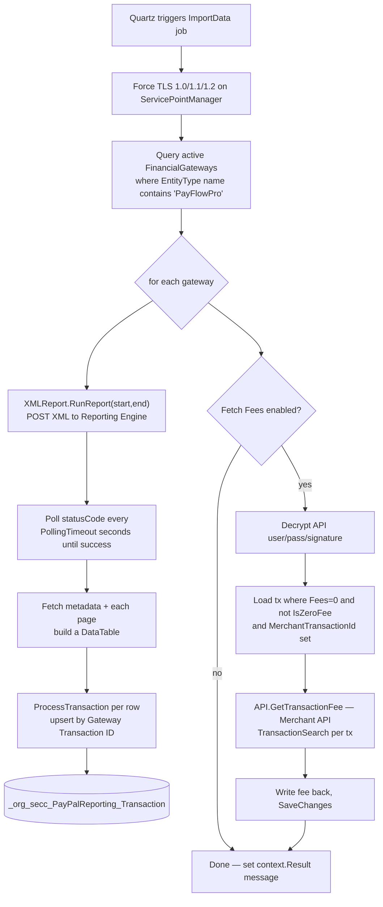

# org.secc.PayPalReporting

> A scheduled job that pulls PayFlow Pro transaction reports out of PayPal and stores them in a custom Rock table, with a block to view/edit individual rows.

> **Doc tier: deep.** This plugin talks to two external PayPal APIs (the PayFlow Pro Reporting XML engine and the classic NVP/SOAP Merchant API), handles encrypted credentials, and has a non-obvious two-pass import + fee-lookup flow — so it's documented at the deeper technical tier (data flow, the report XML contract, edge cases, extending). Most SECC plugins use the lighter standard tier.

## Overview

PayPalReporting backfills a local copy of PayPal/PayFlow Pro giving transactions so they can be reconciled against Rock financial batches. A scheduled `IJob` (`ImportData`) finds every active PayFlow Pro `FinancialGateway`, runs a named report against PayPal's PayFlow Pro **Reporting Engine** (XML over HTTPS), and upserts each row into the custom `_org_secc_PayPalReporting_Transaction` table. A second pass optionally calls the classic PayPal **Merchant API** (`TransactionSearch`) to fill in the per-transaction fee that the report doesn't return. Finance staff view/edit a single transaction through the **PayPal Reporting Transaction** block.

## Project Info

- **Project file:** `org.secc.PayPalReporting.csproj`
- **Root namespace:** `org.secc.PayPalReporting`
- **Target framework:** .NET Framework 4.7.2
- **Deploys to:** `RockWeb/bin/` (assembly + `PayPal*` SDK DLLs) and `RockWeb/Plugins/org_secc/` (block markup)

## Project Layout

```
/                       ImportData.cs — the scheduled IJob (report import + fee lookup)
/Data/                  PayPalReportingContext (EF DbContext on RockContext) + base PayPalReportingService<T>
/Model/                 Transaction entity + TransactionService
/Engine/                XMLReport — drives the PayFlow Pro Reporting Engine; API — classic Merchant API fee lookup
/Services/              PayFlowProReportSvc.cs (auto-generated XSD proxy types) + PayFlowProRequest (HTTP/XML transport)
/Migrations/            Rock plugin migrations (table + FinancialGateway FK)
/org_secc/PayPalReporting/  Transaction.ascx (+ .cs) — view/edit a single stored transaction
```

## How the Import Works

`ImportData` is a Rock `IJob`. Its block/job attributes (declared on the class) populate the Quartz `JobDataMap`; `Execute` reads them, queries the PayFlow Pro gateways, and runs the report per gateway. Authentication for the *report* comes from the gateway's own Rock attributes (`Partner`/`User`/`Vendor`/`Password`); authentication for the *fee lookup* comes from the job's encrypted API attributes.



**Conventions / contracts:**
- **Two PayPal integrations, two credential sources.** The Reporting Engine report is authenticated with the *gateway's* `Partner`/`User`/`Vendor`/`Password` attributes (read live via `Gateway.LoadAttributes()` in `XMLReport.GetAuthRequest`). The fee lookup uses the *job's* encrypted `PayPal API Username/Password/Signature` attributes.
- **Reporting Engine is request/poll/page.** `XMLReport.RunReport` submits a `RunReport` request, then `Thread.Sleep(PollingTimeout)`-polls `statusCode` until `3` (created successfully), reads metadata to size the `DataTable`, and pulls every page (`pageSize = 50`).
- **Upsert key is the report's `Transaction ID`.** `ProcessTransaction` calls `TransactionService.Get(gatewayTransactionId)`; if found it updates in place, otherwise inserts. The SQL PK is on `GatewayTransactionId`, not `Id`.
- **Report column names are string-keyed.** `ProcessTransaction` indexes `DataRow` by literal column names from the PayPal report (`"Transaction ID"`, `"Amount"`, `"PayPal Transaction ID"`, `"Batch ID"`, etc.). `Amount` is divided by 100 (report is in cents) and stored as a `double`.
- **Fee pass is opt-in and second-stage.** Fees are not part of the report; only rows with `Fees == 0 && !IsZeroFee && MerchantTransactionId != ""` are looked up. A returned fee of `0` is counted as a failure (the `IsZeroFee` flag is the manual escape hatch to stop re-querying genuinely fee-free rows).
- The custom `PayPalReportingContext` shares the `RockContext` connection with its EF initializer nulled out (`NullDatabaseInitializer`) — no auto-migration.

## Components

### Scheduled Job

`ImportData : IJob`, marked `[DisallowConcurrentExecution]`. Configured through Rock's Jobs admin (Settings > Jobs); the attribute display names (in **bold**) become `JobDataMap` entries under their space-stripped keys — `Execute` reads them as `ReportName`, `PayPalReportURL`, `FetchFees`, `PayPalAPIUsername`/`Password`/`Signature`, and `DateRange`.

| Setting | Type | Notes |
|---------|------|-------|
| **Report Name** | text (default `GivingReport`) | Name of the PayFlow Pro report/template to run. |
| **PayPal Report URL** | text (default `https://payments-reports.paypal.com/reportingengine`) | Reporting Engine endpoint; switch to the sandbox host for test mode. |
| **Fetch Fees** | bool (default true) | Whether the second pass calls the Merchant API to fill per-transaction fees. |
| **PayPal API Username** | encrypted text | Merchant API (NVP) username — required only when *Fetch Fees* is on. |
| **PayPal API Password** | encrypted text | Merchant API password. |
| **PayPal API Signature** | encrypted text | Merchant API signature. |
| **Date Range** | sliding date range (default `Previous|24|Hour`) | Window of transactions to import. |

If *Fetch Fees* is enabled but any of the three API credentials is blank, the job throws.

### Block

Category in Rock: **SECC > Finance**.

| Block | Purpose |
|-------|---------|
| PayPal Reporting Transaction | View one stored transaction by `TransactionId` page parameter; **Edit** reveals an inline edit panel that writes all fields (including `IsZeroFee`) back to the table. |

The block has no block attributes; it keys entirely off the `TransactionId` query-string parameter.

### Data Model

| Entity | Table | Notes |
|--------|-------|-------|
| `Transaction` | `_org_secc_PayPalReporting_Transaction` | `Rock.Data.Model<Transaction>` + `ISecured`. Holds the report row (gateway + merchant transaction ids, billing name, amount, fees, tender/type, comments, batch id, `IsZeroFee`, `FinancialGatewayId`). **SQL primary key is `GatewayTransactionId`**, not `Id`. |

## Dependencies & Integrations

- **Rock:** `IJob` / Quartz, `RockContext`, `FinancialGatewayService` + `FinancialGateway` attributes, `Rock.Security.Encryption` (credential decrypt), `ExceptionLogService`, `RockBlock`, `SlidingDateRangePicker`, plugin migrations.
- **Third-party:** PayPal **PayFlow Pro Reporting Engine** (XML over HTTPS — hand-rolled transport in `PayFlowProRequest`, XSD-generated types in `PayFlowProReportSvc.cs`); PayPal classic **Merchant API** via `PayPalMerchantSDK` / `PayPalCoreSDK` (`TransactionSearch`); EntityFramework 6; Newtonsoft.Json (referenced).
- **Cross-plugin:** none.

## Migrations

Ships Rock plugin migrations under `/Migrations/`:

- `001_CreateDb` — creates `_org_secc_PayPalReporting_Transaction` (PK on `GatewayTransactionId`, PersonAlias FKs, a covering index on `TenderType`).
- `002_AddFinancialGateway` — adds the `FinancialGatewayId` column + FK to `FinancialGateway` (lets a row be attributed to the gateway it came from, supporting multiple PayFlow Pro gateways).

## Edge Cases & Constraints

- **Synchronous poll with `Thread.Sleep`.** `XMLReport.RunReport` blocks the job thread, sleeping `PollingTimeout` (default 10s) between status checks with **no overall timeout or max-iteration cap** — a report PayPal never finishes will hang the job indefinitely (mitigated by `[DisallowConcurrentExecution]`).
- **Status re-poll resends the original request.** Inside the poll loop the code rebuilds a `GetResultsRequest` but then calls `SendRequest( req )` with the *original* `req` (still the run-report payload), reading `statusCode` off the response — it relies on the run-report response carrying status, not a true results poll.
- **Report column names are a hard contract.** Any rename in the PayPal report template (`"Transaction ID"`, `"Amount"`, `"PayPal Transaction ID"`, …) breaks `ProcessTransaction` with a `KeyNotFoundException`. The `DataTable` indexer is also accessed without a `Columns.Contains` guard.
- **`PayPal Fees` column maps to `0`.** When the report includes a `PayPal Fees` column, `ProcessTransaction` sets `Fees = 0` regardless of value, deferring the real fee to the Merchant API pass.
- **A `0` fee from the Merchant API is treated as failure**, not as a legitimately fee-free transaction — such rows are re-queried on every run unless `IsZeroFee` is manually set on the row (e.g. via the block).
- **`PayFlowProRequest.FormatEndpointURL` has a no-op bug** (`URL.Replace("http://","https://")` discards its result), so an `http://`-prefixed URL is not actually upgraded to HTTPS.
- **Amounts are stored as `double`.** Currency is held as a floating-point `double` (both the SQL `float` column and the model), not `decimal` — acceptable for reporting but not exact.

## Observations

*Noticed while documenting — not a full audit; the import/credential paths stood out.*

- **Security (low):** Merchant API credentials are stored as `EncryptedTextField` job attributes and decrypted only in-memory at run time via `Rock.Security.Encryption` — good. Worth confirming the Jobs admin page (where these attributes are edited) and the **PayPal Reporting Transaction** block are restricted to finance/admin staff, since the block lets a user freely rewrite stored giving amounts/fees.
- **Improvement:** the poll loop (see Edge Cases) has no timeout/iteration cap and re-sends the run-report request instead of a results request; a hung or slow PayPal report blocks the job thread. Consider a bounded retry with a max wait.
- **Improvement:** `ProcessTransaction` indexes the `DataTable` by literal column names with no `Columns.Contains` guard and `!= null` checks on the indexer (which never returns null) — a missing/renamed report column throws rather than skips. Harden the column mapping.
- **Improvement:** `FormatEndpointURL`'s `URL.Replace(...)` result is discarded (a real no-op); the method only prepends a scheme when none is present.
- **Improvement:** several DB contexts/services are newed up inline in the job and block (`new TransactionService( new PayPalReportingContext() )` per call). Fine for a nightly job, but the block creates a fresh context on each of show/edit/save.

## Extending

To capture an additional report column, add the property to the model + a migration column, then map it in `ProcessTransaction` (guarding the column first):

```csharp
// Model/Transaction.cs
[StringLength( 255 )]
[DataMember]
public string AuthCode { get; set; }

// ImportData.cs — ProcessTransaction
if ( dr.Table.Columns.Contains( "Auth Code" ) && dr["Auth Code"] != null )
{
    transaction.AuthCode = dr["Auth Code"].ToString();
}
```

Add a numbered migration under `/Migrations/` (`ALTER TABLE … ADD AuthCode …`) — don't hand-edit migrations that have already run. The PayPal report template must also be configured to emit the new column.

## Making Changes

- Import behavior (gateway selection, report params, fee pass) lives in `ImportData.cs`; the report request/poll/paging logic is in `Engine/XMLReport.cs`, and the raw HTTP/XML transport is in `Services/PayFlowProRequest.cs`.
- Fee-lookup logic against the classic Merchant API is in `Engine/API.cs`.
- The view/edit screen is `org_secc/PayPalReporting/Transaction.ascx(.cs)`; add new tables/columns via a new numbered migration in `/Migrations/`.
- Report authentication uses the PayFlow Pro `FinancialGateway`'s own Rock attributes — change those in Rock admin (Finance > Gateways), not here.
