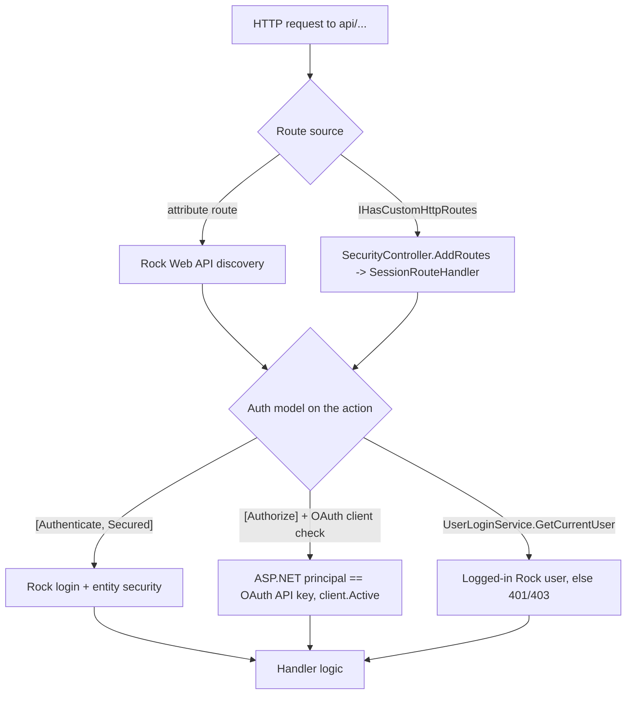

# org.secc.Rest

> Custom Rock REST controllers for SECC's apps — account/SMS login, the Groups mobile app, content-channel/sermon feeds, person matching, and financial-statement data.

> **Doc tier: deep.** This is an externally-facing API surface (several endpoints back native/mobile apps and OAuth clients), with non-trivial auth contracts that differ per controller — so it's documented at the deeper tier (per-endpoint reference, auth model, request/response shapes, extending). Most SECC plugins use the lighter standard tier.

## Overview

This plugin adds Web API controllers to Rock that aren't part of core. They fall into a few groups: **Account / Security** endpoints that back OAuth-client account creation and SMS/forgot-password login flows; the **GroupApp** family that powers SECC's Groups mobile app (group list, members, attendance/self-check-in, schedule and location editing, leader communication); read-only **content feeds** (`ChannelItems`, `SermonFeed`); and a few **extension** controllers (`People/MatchOrCreatePerson`, `GroupMembers/OData`, `Groups` photo upload, `FinancialTransactions` contribution data). Controllers are discovered by Rock's standard Web API routing; one (`SecurityController`) maps its own session-enabled routes.

## Project Info

- **Project file:** `org.secc.Rest.csproj`
- **Root namespace:** `org.secc.Rest` (the sermon controller lives under `org.secc.SermonFeed.Rest`)
- **Target framework:** .NET Framework 4.7.2
- **Deploys to:** `RockWeb/bin/` (assembly only, via `xcopy` PostBuildEvent)
- **Cross-plugin dependencies:** [org.secc.OAuth](../org.secc.OAuth/README.md), [org.secc.Authentication](../org.secc.Authentication/README.md), [org.secc.PersonMatch](../org.secc.PersonMatch/README.md)

## How Routing & Auth Work

Most controllers extend Rock's `ApiControllerBase` (or `ApiController`) and declare their routes with `[Route(...)]` attributes, so Rock's standard Web API route discovery registers them. `SecurityController` is the exception: it implements `IHasCustomHttpRoutes` and registers its own `api/org.secc/People/{action}` routes against a `SessionRouteHandler` so those calls run with ASP.NET session state.



**Auth models in use (they are not uniform — confirm per endpoint):**
- **`[Authenticate, Secured]`** — Rock's filter pair: authenticates the caller and checks entity-level security on the controller action. Used by the extension controllers.
- **`[Authorize]` + OAuth client gate** — `AccountController` resolves the ASP.NET identity name as an OAuth API key via `ClientService.GetByApiKey(...)` and requires `client.Active`. Backs OAuth-client app flows.
- **`UserLoginService.GetCurrentUser()`** — the GroupApp controllers have **no auth attribute**; they call `GetCurrentUser()` and return `401` if null, then do their own per-group leader/member checks (`group.IsAuthorized`, group-member role queries) before acting.
- **`GetPerson()` + `IsAuthorized(VIEW, ...)`** — the content feeds resolve the caller's person and check VIEW on the content channel.

## REST Endpoints

### Account / Security

| Route | Method | Auth | Purpose |
|-------|--------|------|---------|
| `api/account/create` | POST | `[Authorize]` + active OAuth client | Match-or-create a person from a profile, create an Internal (or SMS) `UserLogin`, send confirmation email if unconfirmed. Min age 13 is enforced only when a `Username` is supplied (the validation block is gated on a non-empty username). |
| `api/account/confirmaccount` | POST | `[Authorize]` + active OAuth client | Confirm an account by Rock confirmation code, or by a 6-digit MD5-derived mobile code. |
| `api/account/family` | GET | `[Authorize]` | Family members of the current user (`UserLoginService.GetCurrentUser`). |
| `api/account/forgotpassword` | POST | `[Authorize]` + active OAuth client | Send a forgot-username/password email for resettable logins matching an address. |
| `api/account/profile` | GET | `[Authorize]` | Current user's `Profile`. |
| `api/account/smslogin` | POST | `[Authorize]` + active OAuth client | Start SMS auth: match a single living person of min age by phone, send code via Rock's `SMSAuthentication`. |
| `api/org.secc/People/CurrentUser` | GET | session route; current user **or** a Forms-auth ticket in `{param}` | Returns a small person report (name, campus, gender). Registered via `IHasCustomHttpRoutes`. |
| `api/org.secc/People/Post` | POST | session route | Echoes the posted `phone` string. |

### GroupApp (Groups mobile app)

All require a logged-in user (`GetCurrentUser`, else `401`) and apply per-group authorization as noted.

| Route | Method | Authorization | Purpose |
|-------|--------|---------------|---------|
| `api/GroupApp/GroupList/` | GET | current user | Groups the user is an active member of, within configured GroupApp group types. |
| `api/GroupApp/GetGroup/{groupId}` | GET | member or VIEW | Group summary; optional `getContent` / `getAllowEmailParents`. |
| `api/GroupApp/GetGroupMembers/{groupId}` | GET | member or VIEW | Members; leaders also see address/email/phone/parent contact. Table-based groups filter by `TableNumber`. |
| `api/GroupApp/GroupMembers/{groupId}/Communicate` | POST | EDIT **and** MANAGE_MEMBERS | Send an email to all/one member (optionally parents). |
| `api/GroupApp/GroupMembers/{groupId}/Add` | POST | EDIT **and** MANAGE_MEMBERS | Match-or-create a person and add as a member; copies leader's `TableNumber`. |
| `api/GroupApp/GroupMembers/{groupId}/Remove/{groupMemberId}` | DELETE | EDIT **and** MANAGE_MEMBERS | Hard-delete a group member. |
| `api/GroupApp/Attendance/{groupId}/{occurrenceDate}` | GET | VIEW or leader | Attendance for an occurrence. |
| `api/GroupApp/Attendance/` | POST | leader | Mark a member (of this group) present. Reconciles with the member's existing attendance for the group+date: with `locationId`, matches within that room (+`scheduleId`); without it, matches by group+person+date, preferring a kiosk-origin row, so a kiosk check-in is flipped rather than duplicated. Creates a row if none exists. |
| `api/GroupApp/Attendances/{attendanceId}` | DELETE | leader | Delete an attendance record. |
| `api/GroupApp/Attendance/SelfReport` | GET / POST | member (POST: adult only) | Read/set the current user's own attendance, gated to a window around the occurrence start. |
| `api/GroupApp/Attendance/DidNotMeet` | POST | leader | Mark an occurrence as "Did Not Meet" and clear its attendance. |
| `api/GroupApp/AttendanceSchedules/{groupId}` | GET | VIEW or leader | Past-12-months occurrence list (scheduled + recorded). |
| `api/GroupApp/Groups/{groupId}/Schedule` | GET / PUT | leader | Read/update the group's weekly schedule as iCal (forks a shared schedule on edit). |
| `api/GroupApp/Groups/{groupId}/Location` | GET / PUT | GET: member, PUT: leader | Read/replace the group's single location; PUT runs Rock address `Verify` (geocode). |

### Content / extension

| Route | Method | Auth | Purpose |
|-------|--------|------|---------|
| `api/ChannelItems/{contentChannelId}[/{tag}]` | GET | content-channel VIEW | Paged content-channel items with attributes, tags, child/parent ids; query-string keys filter on attribute values. |
| `api/ChannelItem/{identifier}` | GET | content-channel VIEW | One item by id or slug. |
| `api/sermonfeed/[{slug}/]` | GET | none declared | Speaker-filtered sermon series feed (1-hour `RockCache`). Hardcodes content-channel ids (24/23) and the Speaker attribute id (30285). |
| `api/People/MatchOrCreatePerson` | POST | `[Authenticate, Secured]` | Match a person via [PersonMatch](../org.secc.PersonMatch/README.md); add if none, return the id. |
| `api/GroupMembers/OData` | GET | `[Authenticate, Secured]` | OData query over `GroupMember` with expand support (math functions only). |
| `api/Groups/GetPhoto/{id}` | GET | `[Authenticate, Secured]` | URL of the group's `GroupPhoto` attribute binary file. |
| `api/Groups/UploadPhoto/{id}` | POST | `[Authenticate, Secured]` + binary-file-type EDIT | Upload/replace the group's `GroupPhoto`. |
| `api/secc/FinancialTransactions/GetContributionTransactions/{groupId}[/{personId}]` | POST | `[Authenticate, Secured]` | Build a `DataSet` of contribution transactions (cash only) for a giving group or person. |

## Detailed Reference

Keys / ids in **bold** are load-bearing in code.

### GroupApp group-type configuration *(GroupAppGroupListController / MembersController)*

GroupApp behavior is driven by **defined types** resolved by Guid (not block settings):

| Defined Type Guid | Meaning |
|-------------------|---------|
| **`f75bdfa7-582b-4e0d-9715-5e47b0eb57cf`** | Group types surfaced in the app's group list. |
| **`90526a36-fda6-4c90-997c-636b82b793d8`** | "Table-based" group types — members are filtered to the leader's `TableNumber`. |
| **`3780965b-3da0-4609-9577-cf8d39ec601a`** | "Student" group types. |

Each defined value's `Value` is parsed as an integer GroupTypeId. Other in-code constants: `GroupTracker` is set for GroupTypeId 107/109 on CampusId 1; home/meeting location types resolved via Rock system Guids.

### Account create *(AccountController)*

| Field | Notes |
|-------|-------|
| **EmailAddress** | Must match an existing person for a confident match; mobile last-10 also compared. |
| **Username / Password** | Optional; password validated via `UserLoginService.IsPasswordValid`. |
| **Birthdate** | Min age **13** (`MINIMUM_AGE`) enforced — but only inside the `if ( !string.IsNullOrEmpty( account.Username ) )` block, so a request with no username skips the age check. |
| Match path | `PersonService.GetByMatch`; single match + matching email → reuse, else create a Web-Prospect/Pending person. |

### ChannelItems query filtering *(ChannelItemController)*
Reserved query keys (`contentchannelid`, `tag`, `take`, `page`, `hideInactive`, `orderby`, `reverse`) control paging/sort; **any other query key** is treated as a content-channel-item **attribute key** and filtered on exact attribute value.

### Contribution transactions *(FinancialTransactionsExtensionsController)*
Returns a nested `DataSet` (transactions + per-account details), filtered to the Contribution transaction type and excluding the **non-cash** currency type (`F64662E7-0E12-4604-BBB0-DB774AC3C830`). Without `personId`, pulls everyone whose `GivingGroupId` equals `groupId`.

## Dependencies & Integrations

- **Rock:** `Rock.Rest` (`ApiControllerBase`, `IHasCustomHttpRoutes`, `[Authenticate]`/`[Secured]` filters), Web API + OData, `RockContext` and many services (Person, Group, GroupMember, Attendance, Communication, ContentChannelItem, Schedule, Location, FinancialTransaction), `RockCache`, defined values, `SMSAuthentication`, Rock email/communication.
- **Cross-plugin:** [org.secc.OAuth](../org.secc.OAuth/README.md) (client/API-key validation in `AccountController`), [org.secc.Authentication](../org.secc.Authentication/README.md), [org.secc.PersonMatch](../org.secc.PersonMatch/README.md) (`GetByMatch`, `MatchOrCreatePerson`).
- **Third-party:** Newtonsoft.Json, ASP.NET Web API (incl. OData), EntityFramework, System.Linq.Dynamic (used for the `orderby` string in `ChannelItems`).

## Edge Cases & Constraints

- **GroupApp endpoints carry no auth attribute.** They rely entirely on `GetCurrentUser()` plus hand-rolled per-group checks. Any new GroupApp action must repeat that pattern — there is no filter enforcing it.
- **Hardcoded ids.** `SermonController` hardcodes content-channel ids (24, 23) and a Speaker attribute id (30285); `GetGroups` hardcodes GroupTypeIds 107/109 and CampusId 1; some location lookups use literal `GroupLocationTypeValueId` 19/209. These break if the target environment's ids differ.
- **Schedule edit forks shared schedules.** `PUT .../Schedule` creates a new `Schedule` if the current one is shared by another group/group-location, then repoints the group; legacy `WeeklyDayOfWeek`/`WeeklyTimeOfDay` are cleared in favor of iCal.
- **Location PUT is destructive.** It deletes *all* existing `GroupLocation` rows for the group before adding one (single-location app requirement).
- **`MatchOrCreatePerson` adds the posted `Person` directly** when no match is found — the request body is persisted as a new person with no field sanitization beyond what matching uses.

## Observations

*Noticed while documenting — not a full audit; the auth surface and a few endpoints stood out.*

- **Security (review):** Authorization is inconsistent across controllers and several checks are easy to read as inverted/loose — worth a careful pass. In `ChannelItemController.ChannelItems` the guard is `if ( !contentChannel.IsAuthorized( VIEW, GetPerson() ) ) throw Unauthorized`, but `GetGroup` in `GroupAppGroupListController` uses `if ( isGroupMember || !group.IsAuthorized( VIEW, ... ) )` to *grant* access — i.e. it returns the group when the user is **not** authorized to view it. That condition reads backwards and should be confirmed against intent.
- **Security (low/medium):** GroupApp endpoints have no `[Authenticate]`/`[Secured]` filter and depend solely on `GetCurrentUser()` + manual checks; `GetGroupMembers` exposes member email/phone/address and minors' parent contact info to group leaders. Confirm leader determination is correct and that these routes can't be reached by an unauthenticated session. `api/sermonfeed` has no declared authorization.
- **Security (low):** `SecurityController.CurrentUser(param)` decrypts a Forms-auth ticket from the URL and returns the matching user's report — confirm this `{param}` path is intended to be callable without a Rock login and can't be used to probe accounts.
- **Improvement:** Several handlers `new RockContext()` per request and some construct multiple contexts in one call (e.g. `RemoveGroupMember` opens a second context; `GetGroupMembers` calls `_personService.Get` and `GetFamily` per member — an N+1). `AccountController` calls `MD5` for a 6-digit confirmation code, which is fine for non-secret short codes but shouldn't be mistaken for a security primitive.
- **Improvement:** `AssemblyInfo.cs` still carries the Visual Studio template metadata (`AssemblyCompany("Microsoft")`, `Copyright © Microsoft 2016`) — cosmetic, but worth fixing to SECC.
- **Improvement:** The `.csproj` lists `Rock.Rest` and `DotLiquid` `ProjectReference`s twice each (duplicate entries) — harmless but worth cleaning.

## Extending

Add a controller alongside the others under `Controllers/` (file convention `*Controller.Partial.cs`); attribute routes are picked up by Rock's Web API discovery — no registration step. For GroupApp endpoints, follow the existing auth pattern:

```csharp
public partial class GroupAppExampleController : Rock.Rest.ApiControllerBase
{
    [HttpGet]
    [System.Web.Http.Route( "api/GroupApp/Example/{groupId}" )]
    public IHttpActionResult GetExample( int groupId )
    {
        var currentUser = UserLoginService.GetCurrentUser();
        if ( currentUser == null )
            return StatusCode( HttpStatusCode.Unauthorized );

        var group = new GroupService( new RockContext() ).Get( groupId );
        if ( group == null )
            return NotFound();

        // per-group check — leader or member, per your needs
        // if ( !group.IsAuthorized( Rock.Security.Authorization.VIEW, currentUser.Person ) )
        //     return StatusCode( HttpStatusCode.Forbidden );

        return Ok( /* dto */ );
    }
}
```

Only `SecurityController` needs the `IHasCustomHttpRoutes.AddRoutes` + `SessionRouteHandler` machinery (for session state); the rest do not.

## Making Changes

- New API methods go in the matching `Controllers/*.Partial.cs`; DTOs live in `Models/` (or inline response classes for the account/security controllers).
- GroupApp group-type behavior is configured through the three **defined types** above, not block settings — add/remove GroupTypeIds there rather than editing code.
- Account/login flows depend on [org.secc.OAuth](../org.secc.OAuth/README.md) (active client check) and Rock's `SMSAuthentication`; person matching/creation defers to [org.secc.PersonMatch](../org.secc.PersonMatch/README.md).
- Watch the hardcoded ids in `SermonController` and `GetGroups` when promoting between environments.
