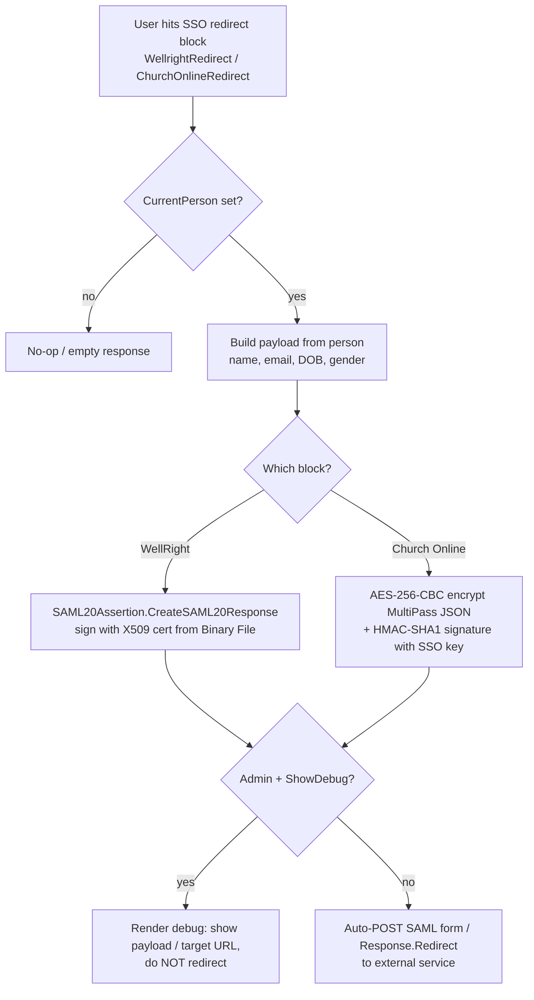

# org.secc.Security

> A grab-bag of SECC security/identity Rock **blocks** — Wi-Fi captive portals, SAML/SSO redirects to third-party services (WellRight, Church Online), PIN management, and self-service account blocks — plus a small reusable SAML 2.0 assertion library.

> **Doc tier: deep.** This plugin brokers credentials and identity to external systems (it builds and signs SAML assertions, derives SSO tokens, and stands up public Wi-Fi onboarding pages), so it's documented at the deeper technical tier — the SSO/redirect flow, per-block config attributes, and the security-sensitive edges. Most SECC plugins use the lighter standard tier.

## Overview

This is Southeast's catch-all **security and identity** plugin. Most of it is RockWeb-compiled blocks (`.ascx` + code-behind) under `org_secc/Security/`, grouped loosely into three jobs: (1) **Wi-Fi captive portals** that register a guest/staff device and bounce the browser back to the FrontPorch controller; (2) **outbound SSO redirects** that log a Rock user into an external service by POSTing a signed SAML assertion (WellRight) or a signed SSO token (Church Online / Tymio-style MultiPass); and (3) **self-service account blocks** (view/edit profile, login-status menu, PIN management). The only csproj-compiled code is a tiny **SAML 2.0** helper library (`SAML2/`) consumed by the WellRight block.

## Project Info

- **Project file:** `org.secc.Security.csproj` — compiles **only** the `SAML2/` library (`CertificateUtility`, `SAML20Assertion`, `SAMLSchema`). The blocks under `org_secc/` are RockWeb-compiled (`.ascx`/`.ascx.cs`), not in the csproj.
- **Root namespace:** `org.secc.Security` (library) / `RockWeb.Plugins.org_secc.Security` (blocks)
- **Target framework:** .NET Framework 4.7.2
- **Deploys to:** `RockWeb/bin/` (the `org.secc.Security.dll` SAML library), `RockWeb/Plugins/org_secc/` (block markup + code-behind), and `RockWeb/Themes/` (the `my-secc` theme) — all via the PostBuildEvent xcopy.
- **Cross-plugin dependency:** [org.secc.PersonMatch](../org.secc.PersonMatch/README.md) (used by the Captive Portal block).

## Project Layout

```
/                       org.secc.Security.csproj (compiles SAML2/ only)
/SAML2/                 SAML 2.0 assertion library: SAML20Assertion (build+sign Response),
                        CertificateUtility (X509 XML signing), SAMLSchema (xsd-generated OASIS types)
/org_secc/Security/     RockWeb blocks (.ascx + .ascx.cs) — the bulk of the plugin (see Components)
/Themes/my-secc/        A full Rock theme (Layouts, Styles/less, Lava asset partials, logo)
```

There is **no `/Migrations` folder** — this plugin ships no plugin migrations; blocks are placed on pages through Rock admin.

## How Outbound SSO Works

Two blocks log an already-authenticated Rock user into an external service. They differ in the token format but share the same shape: read `CurrentPerson`, build a payload, sign it with a configured secret/cert, and POST/redirect the browser to the external endpoint. Both special-case administrators (show a debug screen instead of redirecting, so an admin can inspect the payload).



**Conventions / contracts:**
- **Admin escape hatch.** Every redirect/captive-portal block checks `IsUserAuthorized(ADMINISTRATE)` (or `UserCanAdministrate`) and, instead of redirecting, shows the would-be target URL/payload. This is intentional so staff can configure/debug without being bounced out. WellRight additionally gates the debug screen on a `ShowDebug` block setting and a `Continue` page param.
- **SAML assertions are signed, enveloped, RSA-SHA256.** `SAML20Assertion.CreateSAML20Response` builds an OASIS `ResponseType`/`AssertionType`, and `CertificateUtility.AppendSignatureToXMLDocument` signs the assertion (enveloped + ExcC14N transforms) using the X509 cert's private key, returning a Base64 `SAMLResponse` auto-POSTed via a self-submitting `<form>`.
- **Church Online uses MultiPass-style SSO:** AES-256-CBC encrypt (`RijndaelManaged`, PKCS7) the JSON profile prefixed with a fixed init vector `"OpenSSL for Ruby"`, key = SHA-256 of the SSO key; then HMAC-SHA1 the ciphertext with the raw SSO key; redirect to `…/sso?sso=<cipher>&signature=<hmac>`.
- **Captive portals** validate the MAC-address query param against a regex, create/refresh a Rock `PersonalDevice` (platform/OS parsed from the UA via `UAParser`), link it to a `PersonAlias`, and redirect to the configured release/FrontPorch URL carrying the alias id + original query string.

## Components

### Blocks

Category in Rock: **SECC > Security** (the Captive Portal block uses the plain **Security** category).

| Block | Purpose |
|-------|---------|
| Captive Portal | Public Wi-Fi onboarding: registers a `PersonalDevice` by MAC, matches/creates a person, redirects to the release URL. |
| Staff Captive Portal | Staff Wi-Fi variant that computes a SHA-256 hash and forwards to the SECC FrontPorch cloud endpoint, optionally only on/off a given network (CIDR). |
| Account Detail | Public block for a user to view their own account info (name, email, optional home address). |
| Account Edit | Public block for a user to edit their account info; optional/required address. |
| User Login Status | Login/logout menu + links to My Account / My Profile / My Settings pages. |
| PIN Manager | Person-context block to add/edit/remove PIN logins (`PINAuthentication`), tagged by a "purpose" defined type. |
| ChurchOnline SSO Redirect | Logs the user into Church Online via an encrypted+signed MultiPass token; also posts a check-in `Attendance` record. |
| Wellright Redirect | Logs the user into WellRight by POSTing a signed SAML 2.0 assertion. |
| SignNow Test | Developer/test harness that pushes a hardcoded Binary File to SignNow and resolves an invite link. Not a production block (see Observations). |

#### Captive Portal  *(Security)*
Keys in **bold** are the block attribute keys.

| Setting | Type | Notes |
|---------|------|-------|
| **MacAddressParam** | text (default `client_mac`) | Query-string param holding the device MAC; validated against a MAC regex. |
| **ReleaseLink** | text (required) | Absolute http/https URL the browser is redirected to after registration. |
| **ShowName** / **ShowMobilePhone** / **RequireMobilePhone** / **ShowEmail** / **ShowDOB** | bool | Field visibility; visible name/email/DOB fields are also required. |
| **ShowAccept** / **AcceptanceLabel** | bool / text | "I Accept" checkbox + label (pair with the legal note). |
| **ButtonText** | text (default `Accept and Connect`) | Connect-button caption. |
| **ShowLegalNote** / **LegalNote** | bool / HTML (Lava) | Terms & Conditions rendered into an iframe `srcdoc`; ships a long default T&C. |
| Connection Status | defined value | Connection status for newly created people (default Visitor). |

If no input fields are visible the block "direct-connects" (immediate redirect). Person resolution calls `personService.GetByMatch(...)` — the `GetByMatch` extension method from [org.secc.PersonMatch](../org.secc.PersonMatch/README.md), not a built-in Rock method — before creating a new record.

#### Staff Captive Portal  *(SECC > Security)*
| Setting | Type | Notes |
|---------|------|-------|
| **SECCSecure** | encrypted text (password) | Key used to compute the SHA-256 hash sent to FrontPorch. |
| **MacAddressParam** | text (default `client_mac`) | MAC query param. |
| **NetworkSSID** | text | SSID of the network being connected to. |
| **SeccFPUrl** | text | SECC FrontPorch captive-portal endpoint. |
| **Redirect When** | dropdown | `Always` / `When On Provided Network` / `When NOT On Provided Network`. |
| **Network** | text | CIDR (e.g. `192.168.0.0/24`) compared against the client IP for the redirect condition. |
| **TestingEnabled** | bool | Use the test network. |

Reads the `FrontporchAPIToken` / `FrontporchHost` global attributes for the API call.

#### Wellright Redirect  *(SECC > Security)*
| Setting | Type | Notes |
|---------|------|-------|
| **RequestUrl** | text | `Recipient`/request URL put in the SAML assertion. |
| **PostUrl** | text | Where the signed `SAMLResponse` form auto-POSTs. |
| **CertificateFile** | file (Binary File) | PFX certificate used to sign the assertion. |
| **CertificatePassword** | text | PFX password (stored as a plain block setting — see Observations). |
| **DaysValid** | integer (default 30) | Assertion lifetime (converted to minutes). |
| **ShowDebug** | bool (default false) | Show admins the formatted XML before forwarding. |

Sends `FirstName, LastName, DateOfBirth, Gender, Email` as SAML attributes; `BirthDate.Value` is dereferenced unconditionally (see Edge Cases).

#### ChurchOnline SSO Redirect  *(SECC > Security)*
| Setting | Type | Notes |
|---------|------|-------|
| **RedirectURL** | url (required) | Church Online base URL; SSO appended as `/sso?sso=…&signature=…`. |
| **CheckInGroup** | group-type-group | Group online guests are checked into (requires "Show in Group Lists"). |
| **OnlineCampusLocation** | campus | Campus for the check-in attendance record. |
| **OnlineCampusSchedules** | schedules | Schedules Church Online is available; only an active/check-in-enabled one is used. |
| **SSOKey** | text (password) | Church Online SSO key; SHA-256'd for the AES key and used raw for the HMAC. |

On load it posts an `Attendance` record (if group+campus+active schedule resolve) and then performs the SSO redirect.

#### PIN Manager  *(SECC > Security)*
| Setting | Type | Notes |
|---------|------|-------|
| **PurposeDefinedType** | defined type | Source of the PIN "purpose" checkbox list (stored on the `PINPurpose` UserLogin attribute). |
| **MinimumPINLength** | integer (default 6) | Minimum PIN digit count enforced on save. |

A `PersonBlock`; add/edit/delete are gated on `PINAuthentication` entity-type `ADMINISTRATE` authorization, and the code guards against editing a non-PIN `UserLogin`.

#### Account Detail / Account Edit  *(SECC > Security)*
Both `RockBlock`s with a **Detail Page** (`LinkedPage`, Detail only), a **Show (Home) Address** toggle, a **Location Type** (`GroupLocationTypeField`, family), and (Edit) an **Address Required** toggle.

#### User Login Status  *(SECC > Security)*
**MyAccountPage**, **MyProfilePage**, **MySettingsPage** linked pages. The menu renders only two items — **My Account** and **My Profile** — each hidden when its page attribute is blank (a blank **My Account Page** falls back to the `MyAccount` page route). **MySettingsPage** is declared as a block attribute but is currently unused: there is no "My Settings" menu item in the markup or code-behind. Logout also fires a `UpdateUserLastActivity` task and signs out via `FormsAuthentication`.

### SAML 2.0 Library (`SAML2/`)

| Type | Purpose |
|------|---------|
| `SAML20Assertion` | Static `CreateSAML20Response(issuer, expirationMinutes, audience, subject, recipient, attributes, cert)` → Base64 signed SAML `Response`. Builds Response/Assertion/Subject/Conditions/AuthnStatement/AttributeStatement, serializes, and signs. |
| `CertificateUtility` | `AppendSignatureToXMLDocument(...)` — enveloped RSA-SHA256 XML signature over the `<Assertion>` using the cert's exported private key via a PROV_RSA_AES CSP. |
| `SAMLSchema` | `xsd.exe`-generated OASIS SAML 2.0 / XML-DSig types (`ResponseType`, `AssertionType`, etc.). |

## Dependencies & Integrations

- **Rock:** `RockBlock` / `PersonBlock`, `RockContext`, `PersonService` / `PersonalDeviceService` / `UserLoginService` / `AttendanceService`, `RockPage.LinkPersonAliasToDevice`, `Rock.Security.Authorization`, `DefinedValueCache` / `DefinedTypeCache`, `GlobalAttributesCache`, `Rock.SignNow` (`SignNow`, `SignNowSDK`), block-attribute framework, Lava merge-field resolution.
- **Third-party:** `System.Security.Cryptography.Xml` (SAML signing), `UAParser` (device/OS parsing in captive portals), `Newtonsoft.Json` (MultiPass + SignNow), external services **WellRight**, **Church Online**, **SignNow**, and the SECC **FrontPorch** captive-portal cloud.
- **Cross-plugin:** [org.secc.PersonMatch](../org.secc.PersonMatch/README.md) — imported by the Captive Portal block.

## Edge Cases & Constraints

- **WellRight requires a birthdate.** `GetResponse()` calls `CurrentPerson.BirthDate.Value.ToString("o")` with no null check — a logged-in person without a DOB throws. Confirm the WellRight audience always has DOB, or guard it.
- **Captive Portal `CreateRedirectUrl` appends `Request.QueryString` verbatim** onto the release link. The release link itself is validated as an absolute http/https URL, but the trailing query string is the raw inbound one.
- **Admin users never actually SSO.** WellRight, Church Online and the Captive Portal all short-circuit for `ADMINISTRATE` users into a debug message rather than redirecting — testing SSO end-to-end requires a non-admin account (or, for WellRight, `?Continue=true`).
- **Church Online MultiPass tokens are short-lived** (`Expires = now + 5 minutes`, UTC) and the init vector is the fixed string `"OpenSSL for Ruby"` — a MultiPass/Tymio convention, not a per-request IV.
- **PIN Manager parses PINs as numbers.** A PIN is converted via `AsDouble()`; a PIN of `0` (or non-numeric) is rejected, and uniqueness is checked against existing usernames before save.

## Observations

*Noticed while documenting — not a full audit; the SSO/redirect blocks and the test block stood out.*

- **Security (review):** `WellrightRedirect.CertificatePassword` is a plain `TextField` block setting (the PFX itself is a Binary File). Anyone who can administer the block can read the signing-cert password, and it isn't an `EncryptedTextField` like Staff Captive Portal's `SECCSecure`. Worth confirming block security is locked to trusted staff and considering an encrypted attribute.
- **Security (review):** Church Online's SSO scheme uses a **fixed IV** (`"OpenSSL for Ruby"`) and HMAC-**SHA1**. Both are dictated by the Church Online/MultiPass spec, so they likely can't change unilaterally, but they're weak primitives worth noting if the integration is ever revisited. The `SSOKey` is a non-encrypted password `TextField`.
- **Security (low):** `SignNowTest` is a "Test for sign now" block with a **hardcoded document Guid** (`5bb17a5b-…`) that creates a SignNow document/invite for `CurrentPerson` on every page load, writes a temp PDF to disk, and has no auth gating beyond page security. It looks like dev scaffolding; confirm it isn't deployed on a reachable production page.
- **Security (low):** `CertificateUtility` exports the signing cert's private key to an XML string (`PrivateKey.ToXmlString(true)`) and re-imports it into a CSP on every sign. Functional, but the private key transits managed memory in the clear; fine for an internal signing path, noted for awareness.
- **Improvement:** Several blocks `new RockContext()` repeatedly within a single request (e.g. Captive Portal creates a fresh context in `DoesPersonalDeviceExist`, `CreateDevice`, `VerifyDeviceInfo`, `Prefill`). Minor, but consolidating to one context per request would be cleaner.
- **Improvement:** The compiled assembly contains only the SAML2 library; everything else is RockWeb-compiled. A maintainer touching a block won't see it in the csproj — note that when adding files.

## Extending

To add another outbound-SSO block, follow `WellrightRedirect` and reuse the SAML library (or `ChurchOnlineRedirect` for a token scheme). Minimal SAML skeleton:

```csharp
[DisplayName( "My SSO Redirect" )]
[Category( "SECC > Security" )]
[FileField( Rock.SystemGuid.BinaryFiletype.DEFAULT, "Certificate", "Signing PFX.", key: "CertificateFile" )]
[TextField( "Certificate Password", Key = "CertificatePassword" )]
[TextField( "Post Url", Key = "PostUrl" )]
public partial class MySsoRedirect : Rock.Web.UI.RockBlock
{
    protected override void OnLoad( EventArgs e )
    {
        base.OnLoad( e );
        if ( IsPostBack || CurrentPerson == null ) return;

        var cert = LoadCertFromBinaryFile( GetAttributeValue( "CertificateFile" ).AsGuid(),
                                           GetAttributeValue( "CertificatePassword" ) );
        var attrs = new Dictionary<string, string> { { "Email", CurrentPerson.Email } };
        var saml = org.secc.Security.SAML2.SAML20Assertion.CreateSAML20Response(
            "Southeast Christian Church", 60, "MyAudience",
            CurrentPerson.Email, GetAttributeValue( "PostUrl" ), attrs, cert );

        if ( UserCanAdministrate ) { /* show debug, don't redirect */ return; }
        // auto-POST a self-submitting <form> with the Base64 SAMLResponse
    }
}
```

There is no MEF/registration step — these are Rock blocks, placed on a page via Rock admin and configured through the block settings.

## Making Changes

- Block behavior lives in `org_secc/Security/<Block>.ascx.cs` (markup in the matching `.ascx`); these are RockWeb-compiled, not in the csproj.
- SAML payload/signing changes go in `SAML2/SAML20Assertion.cs` / `CertificateUtility.cs` (the only csproj-compiled code, shipped as `org.secc.Security.dll`).
- Captive-portal person matching delegates to the `GetByMatch` extension method in [org.secc.PersonMatch](../org.secc.PersonMatch/README.md) (invoked on `PersonService`) — change matching there, not here.
- The bundled `Themes/my-secc` theme (Layouts/Styles/Lava partials) is deployed by the same PostBuildEvent; theme edits live under `Themes/my-secc/`.
- `SignNowTest` is test scaffolding — don't extend it for production; build a proper block instead.
