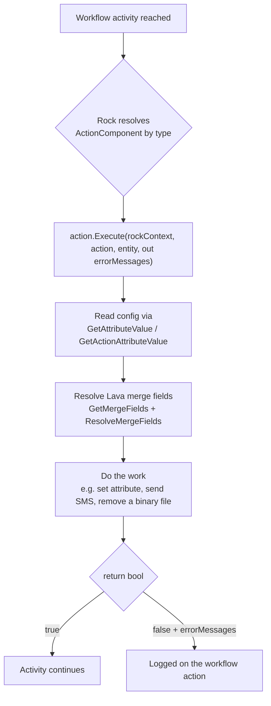

# org.secc.Workflow

> A library of custom Rock workflow **actions** (plus two bulk-workflow admin blocks) covering people, communications, registrations, media, and workflow control.

> **Doc tier: deep.** This is a high-traffic, widely-referenced plugin, so it's documented at the
> deeper technical tier (action contracts, config attributes, data flow, extending). Most SECC
> plugins use the lighter standard tier.

## Overview

This is Southeast's catch-all workflow-extension plugin. It supplies ~27 custom workflow
**actions** that drop into Rock's workflow engine, organized by area (person matching, SMS,
connections, registrations/discount codes, attribute-matrix manipulation, and workflow
control). It also ships two admin blocks for selecting and updating workflows in
bulk. Actions are discovered by Rock via MEF (`[Export(typeof(ActionComponent))]`) and configured
entirely through Rock block/workflow attributes — no code change is needed to wire one into a
workflow.

## Project Info

- **Project file:** `org.secc.Workflow.csproj`
- **Root namespace:** `org.secc.Workflow`
- **Target framework:** .NET Framework 4.7.2
- **Deploys to:** `RockWeb/bin/` (assembly) and
  `RockWeb/Plugins/org_secc/` (block markup)
- **Cross-plugin dependency:** [org.secc.PersonMatch](../org.secc.PersonMatch/README.md)

## How These Actions Work

Each action is a subclass of Rock's `ActionComponent` exported via MEF. Rock discovers the
exported components at startup, renders their declared attributes in the workflow-configuration
UI, and calls `Execute` when a workflow activity reaches the action.



**Conventions every action follows:**
- `[ActionCategory("SECC > …")]` — the group it appears under in the workflow editor.
- `[ExportMetadata("ComponentName", "…")]` — the display name.
- `[Description("…")]` — the help text.
- Inputs are declared with `[WorkflowTextOrAttribute(...)]` (literal **or** attribute reference,
  Lava-enabled), `[WorkflowAttribute(...)]` (attribute reference only), `[TextField]`,
  `[BooleanField]`, etc., and read at runtime via `GetAttributeValue(action, key, checkWorkflowAttributeValue: true)`.

## Action Reference

| Action (ComponentName) | Category | Purpose |
|------------------------|----------|---------|
| Person Attribute From Fields | People | Resolve/insert a person via SECC matching; optionally create. |
| PersonAddHistory | People | Add a history record to the selected person. |
| SMS Send | Communication | Send SMS/MMS to a person or phone number. |
| SetConnectionRequestGroup | Connections | Set the group of a connection request. |
| SetConnectionAttributeValue | Connections | Set attributes of a connection request. |
| AutoApplyDiscountCode | Registrations | Apply a discount to an unpersisted RegistrationState. |
| GenerateDiscountCode | Registrations | Generate a new discount code on a registration template. |
| UpdateDiscountCodeWithAttribute | Registrations | Update an existing discount code. |
| SetAttributeFromRegistrantField | Registrations | Set an attribute from a registrant field by key + index. |
| UpdateRegistrationGroupWithPlacementGroup | Registrations | Sync a registration group with its placement group. |
| SetAttributeValue (SECC) | Workflow Attributes | Set an attribute to the selected value. |
| CopyAttributesFromWorkflow | Workflow Attributes | Copy attribute values between workflows. |
| AttributeMatrix Add / Update / Delete / Copy Row | Workflow Attributes | Manipulate attribute-matrix rows. |
| BinaryFileFromBase64String | Workflow Attributes | Save a Base64 string as a Binary File. |
| Activate Workflow with Lava | Workflow Control | Activate a new workflow with provided attribute values. |
| ProcessWorkflow | Workflow Control | Process another workflow with provided attribute values. |
| ReActivateActivity | Workflow Control | Reactivate an activity and its actions. |
| DeleteVisitActivity | Workflow Control | Delete a visit activity and its actions. |
| ClearAuthCache | Workflow Control | Clear the authorization cache. |
| ScheduleNextStartDate | Schedule | Get the next start date for a schedule. |
| StoreSignedDocument | Signature Document | Create a new signature document. |
| ClearCacheTags | CMS | Clear cached items with the selected tag(s). |
| Lookup | Twilio | Make a Twilio Lookup API call. |
| BinaryFileRemove | Media | Remove a Binary File. |

## Detailed Actions

Configuration reference for the most-used / most-complex actions. Keys in **bold** are the
attribute keys used in code.

### Person Attribute From Fields  *(People)*
Resolves a person from loose field data using [org.secc.PersonMatch](../org.secc.PersonMatch/README.md);
creates one when no single match is found (unless `Match Only`).

| Setting | Type | Notes |
|---------|------|-------|
| First Name / Last Name / Date of Birth | text-or-attribute (Lava) | Identity fields used for matching. |
| Email Address / Phone Number | text-or-attribute (Lava) | Optional; used for match + new-person creation. |
| Unlisted / Messaging Enabled | text-or-attribute | Only `True`/`False` honored; other values ignored. |
| Address | attribute | Address for a newly created person. |
| Default Campus | attribute | Campus used when creating a new person. |
| Family Group/Member | attribute | Family group/member for a newly created person. |
| **Person Attribute** | attribute (output) | Set to the matched/created person. |
| **Match Only** | bool (default false) | If true, never creates; only sets on a single match. |
| **Create Nameless Person** | bool | With Match Only=false and insufficient data, create a nameless person. |
| **Continue On Error** | bool (default false) | Let the workflow continue on incomplete data. |

### Activate Workflow with Lava  *(Workflow Control)*
| Setting | Type | Notes |
|---------|------|-------|
| **Workflow Name** | text (required) | Name of the new workflow. |
| Workflow Type from Attribute | attribute | Either this or a configured Workflow Type must be set. |
| **Workflow Attribute** | attribute (output) | Holds the newly activated workflow. |

Attribute values for the new workflow are supplied via Lava — letting one workflow spin up
another with computed values.

### SMS Send  *(Communication)*
| Setting | Type | Notes |
|---------|------|-------|
| **From** | text-or-attribute | Person or number; defaults to the org number `733733`. |
| **To** (Recipient) | text-or-attribute | Person or phone number. |
| **Message** | text-or-attribute (Lava) | Body. |
| Attachment | attribute | MMS attachment (carrier/device dependent). |
| **SaveCommunicationHistory** | bool (default false) | Persist a communication record (to the person if one is provided). |

## Blocks

Category in Rock: **SECC > Workflow**.

| Block | Purpose |
|-------|---------|
| Workflow Bulk Select | Tool for bulk-selecting workflows. |
| Workflow Bulk Update | Tool for updating workflows in bulk. |

## Dependencies & Integrations

- **Rock:** workflow engine (`ActionComponent`), `RockContext`, connections, registrations, CMS cache.
- **Cross-plugin:** [org.secc.PersonMatch](../org.secc.PersonMatch/README.md) (used by *Person Attribute From Fields*).
- **Third-party:** Twilio (lookup).

## Edge Cases & Constraints

- **Person matching can create records.** *Person Attribute From Fields* will insert a person
  unless `Match Only` is set — review that flag in any workflow that takes public input.

## Extending

To add an action, drop a class in the relevant area folder following this shape:

```csharp
[ActionCategory( "SECC > Workflow Control" )]
[Description( "What it does." )]
[Export( typeof( ActionComponent ) )]
[ExportMetadata( "ComponentName", "My Action" )]
[WorkflowTextOrAttribute( "Some Input", "Some Input", "Help text.", true, "", "", 0, "SomeInput" )]
public class MyAction : ActionComponent
{
    public override bool Execute( RockContext rockContext, WorkflowAction action,
        object entity, out List<string> errorMessages )
    {
        errorMessages = new List<string>();
        var input = GetAttributeValue( action, "SomeInput", true );
        // … do work …
        return true;
    }
}
```

No registration step is required — MEF discovers `[Export(typeof(ActionComponent))]` at startup,
and the attributes render the configuration UI automatically.

## Making Changes

- Add new actions in the matching area folder (`Person/`, `Communication/`, …); follow an existing
  sibling as a template.
- Person-matching behavior lives in [org.secc.PersonMatch](../org.secc.PersonMatch/README.md), not here.

**Last updated:** 2026-07-07
